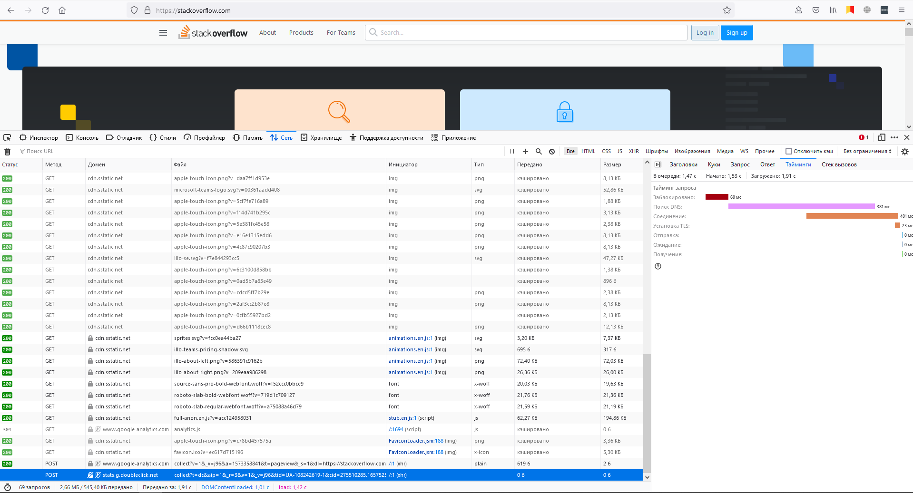

# Домашнее задание к занятию "3.6. Компьютерные сети, лекция 1"
1. Ответ сервера: http код ```403 Forbidden``` - это означает что сервер понял запрос, но у нас нет доступа к этой странице.
2. Ответ сервера: ```200 OK```.  
   Дольше всего выполнялся POST на ```stats.g.doubleclick.net```. Он выполнялся 1,91 секунд.  
   
3. IP адрес: 50.7.93.84
4. Из ответа утилиты WhoIs:  
   ```
   OriginAS:       AS174, AS30058
   Organization:   FDCservers.net (FDCSE)
   ```
5. Вывод команды ```traceroute -An 8.8.8.8```.
    ```
    vagrant@ubuntu-20:~$ traceroute -An 8.8.8.8
    traceroute to 8.8.8.8 (8.8.8.8), 30 hops max, 60 byte packets
    1  192.168.1.254 [*]  1.156 ms  1.277 ms  1.480 ms
    2  100.115.0.1 [*]  5.228 ms  6.031 ms  6.027 ms
    3  212.188.1.6 [AS8359]  5.450 ms  5.446 ms  5.770 ms
    4  * * *
    5  72.14.223.74 [AS15169]  7.378 ms  7.592 ms 72.14.223.72 [AS15169]  7.588 ms
    6  * 108.170.250.34 [AS15169]  4.707 ms 108.170.250.99 [AS15169]  5.192 ms
    7  72.14.234.54 [AS15169]  22.045 ms 142.250.238.214 [AS15169]  23.170 ms 142.250.238.138 [AS15169]  20.610 ms
    8  142.250.235.74 [AS15169]  20.826 ms 66.249.95.224 [AS15169]  20.374 ms 142.250.235.62 [AS15169]  20.152 ms
    9  216.239.47.167 [AS15169]  22.350 ms 142.250.208.25 [AS15169]  21.022 ms 72.14.237.199 [AS15169]  22.912 ms
    10  * * *
    11  * * *
    12  * * *
    13  * * *
    14  * * *
    15  * * *
    16  * * *
    17  * * *
    18  * * *
    19  8.8.8.8 [AS15169]  22.924 ms  20.831 ms *
    ```
6. Вывод mtr:  
     
   В среднем самое долгое время ответа у AS15169 172.253.79.169
7. dig по имени ```dns.google``` возвращает следующие A записи:  
    ```
    dns.google.             900     IN      A       8.8.8.8
    dns.google.             900     IN      A       8.8.4.4
    ```
    За имя отвечают сервера:  
    ```
    ns1.zdns.google
    ns2.zdns.google
    ns3.zdns.google
    ns4.zdns.google
    ```
8. Основываясь на выводе команды ```dig -x``` за адресами 8.8.8.8 и 8.8.4.4 закреплено только имя ```dns.google.```  
   